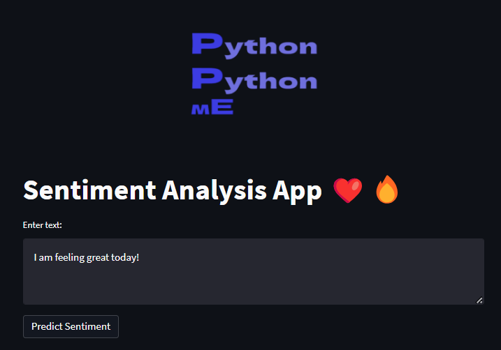
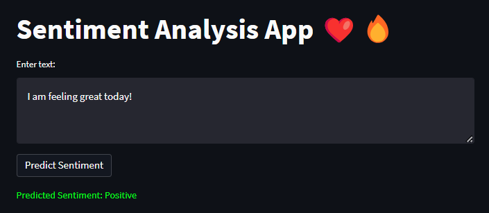
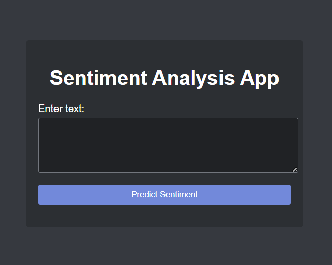
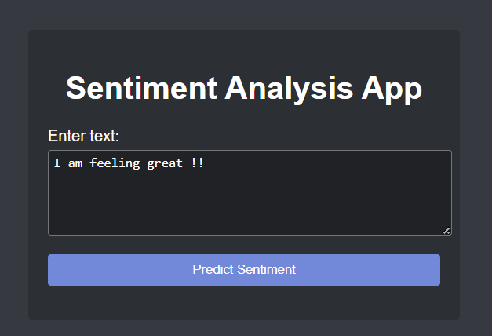
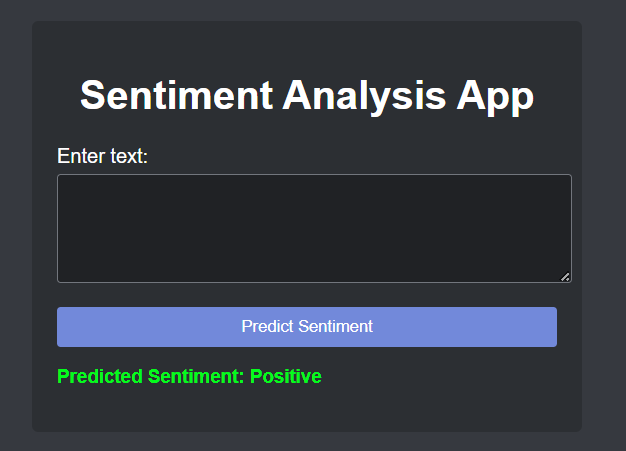

# Sentiment Analysis App ❤️🔥🫶

This is a simple web application built with Streamlit for performing sentiment analysis on text input. It uses the Natural Language Toolkit (NLTK) library and the VADER sentiment analysis model.

## Installation

1. Clone the repository:

```   
git clone https://github.com/your-username/sentiment-analysis-app.git
```

1. Navigate to the project directory:
```
cd sentiment-analysis-app
```

2. Install the required dependencies:
```
pip install -r requirements.txt
```
3. Run the application:
```
streamlit run app.py
```
This will launch the application in your default web browser.

## Usage

Enter the text you want to analyze in the text area provided.

Click the "Predict Sentiment" button to perform sentiment analysis on the input text.

The predicted sentiment will be displayed below the button with color and style indicating the sentiment result:

* **Positive sentiment**: Green color, normal weight, and font size 15px.

* **Negative sentiment**: Red color, bold weight, and font size 15px.

* **Neutral sentiment**: Light blue color, normal weight, and font size 15px.

## Demo

* This is the 1st visiting page which welcomes you

* 

* Enter any text and press the **Predict Sentiment** button.



**Note**

* The same app in flask can look like this :



* Enter some text



* The predicted the sentiment



## Example

Sentiment Analysis App

## Credits

* The application is built using **Streamlit**, a Python library for creating web applications.

* Sentiment analysis is performed using the **NLTK** library and the VADER sentiment analysis model.

## Find the FLASK app of the same here

https://sentiment-app2.onrender.com/
